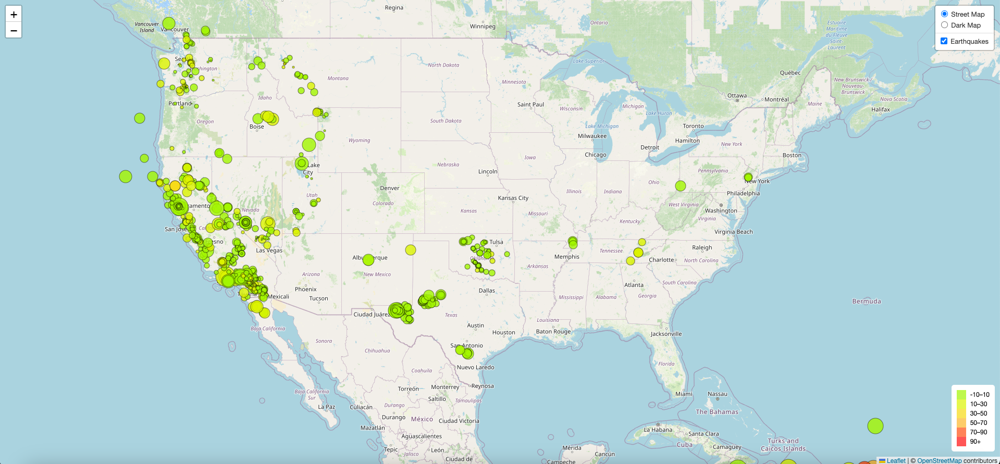
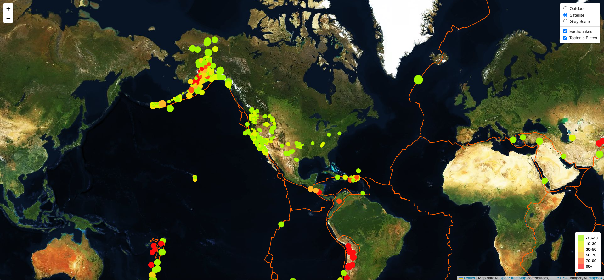

# Earthquake Dashboard

## Project Description
The United States Geological Survey, or USGS for short, is responsible for providing scientific data about natural hazards, the health of our ecosystems and environment, and the impacts of climate and land-use change. Their scientists develop new methods and tools to supply timely, relevant, and useful information about the Earth and its processes.

The USGS is interested in building a new set of tools that will allow them to visualize their earthquake data. They collect a massive amount of data from all over the world each day, but they lack a meaningful way of displaying it.

This is a map to visualize USGS data that will allow them to better educate the public and other government organizations (and hopefully secure more funding) on issues facing our planet.

## Tools / Techniques Used:
* JavaScript
* Leaflet.js
* D3.js
* HTML/CSS
* GeoJSON
* Mapbox API

## Part 1: Create the Earthquake Visualization

### Data source: 
[USGS GeoJSON Feed](https://earthquake.usgs.gov/earthquakes/feed/v1.0/geojson.php)
Used [USGS All Earthquakes from the Past 7 Days"](https://earthquake.usgs.gov/earthquakes/feed/v1.0/summary/all_week.geojson)

For this step change the JavaScript(src) in the index.html to Leaflet-Part-1/static/js/logic.js:
` <!-- Our JavaScript -->
   
  <!-- -->`

A map that plots all earthquakes in the past 7 days based on their longitude and latitude was created:

* Data markers reflect the magnitude of the earthquakes in their size and the depth of the earthquake by color. Earthquakes with higher magnitudes appear larger and 
  earthquakes with greater depth appear darker in color.
* The map includes popups that provide additional information about the earthquake when a marker is clicked.
* A legend that provides context for the map data was created.

## Part 2: Gather and Plot More Data (Optional)

Plot a second dataset on above map to illustrate the relationship between tectonic plates and seismic activity. 

### Data source: 
[Tectonic Plates Data](https://github.com/fraxen/tectonicplates)

For this step change the JavaScript(src) in the index.html to Leaflet-Part-2/static/js/logic2.js:
` <!-- Our JavaScript -->
  <!-- --> 
  `

Following tasks were performed:

* Plotting the tectonic plates dataset on the map in addition to the earthquakes.
* Added other base maps - Satellite and Grayscale to choose from.
* Put each dataset into separate overlays that can be turned on and off independently.
* Added layer controls to the map.

